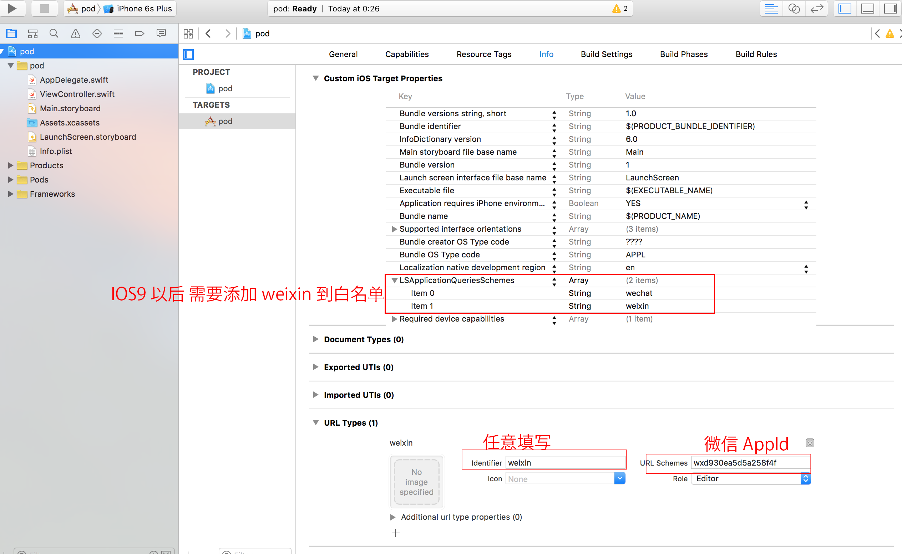
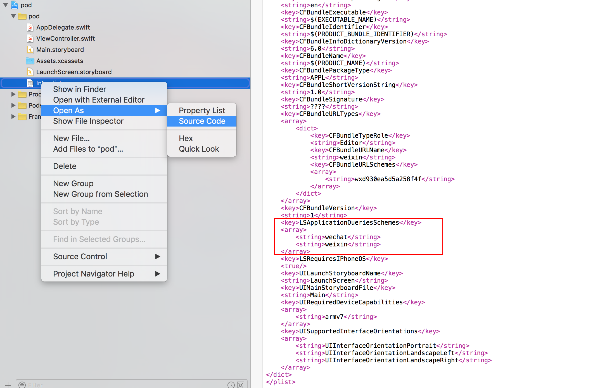

#WechatKit

[](https://travis-ci.org/starboychina/WechatKit)
[](https://developer.apple.com/swift/)
[](https://github.com/Carthage/Carthage)
[](https://cocoapods.org/pods/WechatKit)
[](https://tldrlegal.com/license/mit-license)
[](https://github.com/starboychina/WechatKit/releases)

---
##Getting Started
- CocoaPods

```ogdl
pod 'WechatKit'
```

- Carthage

[安装Carthage](https://github.com/starboychina/WechatKit/blob/master/Carthage.md)

```ogdl
github "starboychina/WechatKit"
```

##Setting

- 设置URL scheme

    在Xcode中，选择你的工程设置项，选中“TARGETS”一栏，在“info”标签栏的“URL type“添加“URL scheme”为你在微信开放平台,注册的应用程序id



- IOS9以后 需要添加weixin到白名单(如图)

    或以源代码方式打开info.plist, 并添加以下内容.
```xml
	<key>LSApplicationQueriesSchemes</key>
	<array>
		<string>wechat</string>
		<string>weixin</string>
	</array>
```


- AppDelegate的handleOpenURL和openURL方法：

    在AppDelegate.swift中添加import WechatKit

```swift
    func application(application: UIApplication, handleOpenURL url: NSURL) -> Bool {
        return self.application(application, openURL: url, sourceApplication: nil, annotation: [])
    }

    func application(application: UIApplication, openURL url: NSURL, sourceApplication: String?, annotation: AnyObject) -> Bool {
        return WechatManager.sharedInstance.handleOpenURL(url)
        // 如需要使用其他第三方可以 使用 || 连接 其他第三方库的handleOpenURL
        // return WechatManager.sharedInstance.handleOpenURL(url) || TencentOAuth.HandleOpenURL(url) || WeiboSDK.handleOpenURL(url, delegate: SinaWeiboManager.sharedInstance) ......
    }
```

##Usage
- 注册app
```swift
  WechatManager.appid = "微信开放平台,注册的应用程序id"
  WechatManager.appSecret = "微信开放平台,注册的应用程序Secret"
```
- 检测微信是否安装
```swift
  WechatManager.sharedInstance.isInstalled()
```
- 使用微信登录

    默认会记住openid,以及access_token,在token还在有效期时,调用checkAuth则不会打开微信客户端,直接使用token和微信服务器获取认证信息
```swift
    WechatManager.sharedInstance.checkAuth { result in
        switch result {
        case .Failure(let errCode)://登录失败
            print(errCode)
        case .Success(let value)://登录成功 value为([String: String]) 微信返回的openid access_token 以及 refresh_token
            print(value)
        }
    }
```
- 获取微信用户信息
```swift
  WechatManager.sharedInstance.getUserInfo { result in
      switch result {
      case .Failure(let errCode)://获取失败
          print(errCode)
      case .Success(let value)://获取成功 value为([String: String]) 微信用户基本信息
          print(value)
      }
  }
```
- 退出登录

    由于默认会记住openid,以及access_token,如需要切换用户则需要退出登录.
```swift
WechatManager.sharedInstance.logout()
```

---

- 分享到微信

```swift
  WechatManager.sharedInstance.shareDelegate = self
  /**
  分享

  - parameter scence:      请求发送场景
  - parameter image:       消息缩略图
  - parameter title:       标题
  - parameter description: 描述内容
  - parameter url:         地址
  - parameter extInfo:     app分享信息(点击分享内容返回程序时,会传给WechatManagerShareDelegate.showMessage(message: String)
  */
  WechatManager.sharedInstance.share(scence: WXScene, image: UIImage?, title: String, description: String, url: String? = default, extInfo: String? = default)
```

- Delegation

[分享Delegation](https://github.com/starboychina/WechatKit/blob/master/WechatKit/WechatManagerShareDelegate.swift)

```swift
    //app分享后 点击分享返回时调用
    func showMessage(message: String)
```
